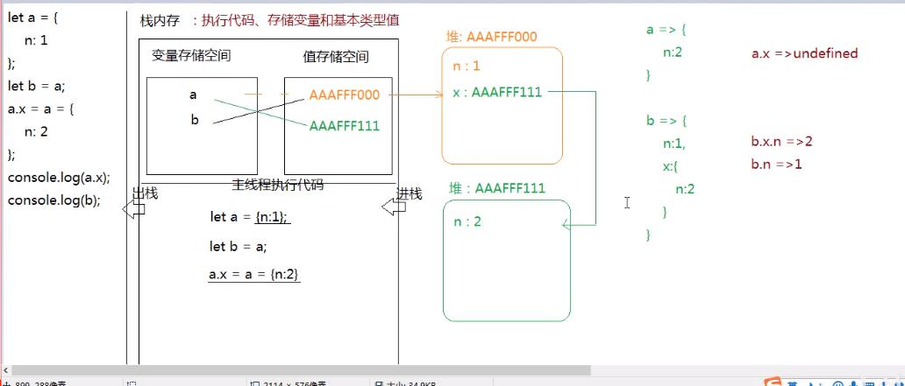

## 浏览器运行JS代码的流程
1. 分配代码执行环境
当浏览器的内核（引擎）渲染和解析js的时候，首先会提供一个供js代码运行的环境，我们**把这个环境称之为全局作用域（global scope）**
全局环境在客户端叫做window，在后台环境叫做global。

2. 预编译
js代码在解析执行之前会先进行预编译，这个过程会发生变量提升。

3. 单线程执行
.浏览器分配一个主线程（不是进程），用来从上而下执行js代码，解析一行执行一行，因为js是解释性编程语言

## 栈内存

### 栈内存的特点
JS中的代码运行的环境——全局作用域，也称之为栈内存。它具有以下特点：
1. 代码都在栈内存中进行执行，栈内存为js代码的执行提供了运行环境
2. 所有的基本类型的值都存储在栈内存的值存储空间中（如果是引用类型的值，那么栈内存的值存储空间中存的是堆内存中引用地址）
3. 所有声明的变量都是存储在栈内存中的变量存储空间中

### 变量声明基本值过程
下面是一个基本值变量声明的详细过程，基本分为三步，以var a = 12为例子：
1. 声明变量并存储
创建变量a，并将创建的变量存储在栈内存中的变量存储空间内

2. 创建值并进行存储
创建值12，并将创建的12存储在栈内存中的值存储空间内

3. 变量与值产生关联也就是赋值
让变量a和值12产生关联，其实赋值就是让变量和值互相关联的过程

### 基本值的按值操作
按值操作：意思就是基本数据类型的值在赋值的时候，会把原有的值复制一份，放到新的内存空间，和原来的值没有任何关系。
以下面这个例子为例：
```js
var a = 12;
var b = a ;
```
var a = 12的过程已经说过了，下面重点说下将a变量的值赋值给b变量的过程：
1. 首先在当前作用域下创建一个新变量b，并存储至一个新的变量存储空间内
2. 按值操作：将a变量存储的值12复制一份，将复制的值12放到新的值存储空间内
3. 让变量b和复制的值12产生关联，和存储变量a的内存空间没有任何关系


## 堆内存

### 堆内存的特点
JS中独立于栈内存的内存空间，我们称之为堆内存。
引用类型的值由于比较复杂，不能直接存储在栈内存中。而是将引用类型的值存储在堆内存中，堆内存的引用地址存储在栈内存中。
值得一提的是：对象在堆内存中存储的是键值对，函数在堆内存中存储的是代码字符串。

### 变量声明引用值过程
下面是一个引用值变量声明的详细过程，比基本值的声明多了两步，以var a = {demo:666}为例子：
1. 创建变量a存储在栈内存中的变量存储空间内
2. 在堆内存中开辟一个新的内存空间，把对象的键值对如demo和666依次存储起来，为了保证后面可以找到这个空间，**此空间有一个16进制的引用地址**
3. 将此引用地址存储在栈内存中的值存储空间中
4. 让变量a和值存储空间中的引用地址产生关联

### 引用值的按址操作
按址操作：意思就是引用数据类型的值在操作的时候，会将原有的引用类型值的内存空间的引用地址进行复制，所以会出现多个变量存储同一个引用地址，从而指向同一个内存空间，变量对于引用数据的值的操作会影响其他变量的值。
```js
var a = {demo：666};
var b = a ;
b.demo = 777;
console.log(a); // {demo:777} b变化会影响a的值 因为a和b变量在栈内存中存储的都是同一个引用地址
```

## 变量的连续赋值问题
变量的连续赋值，我们以一个例子来详细说明下这个过程都发生了那些事情：
```js
var a = b = 10;
```
在运算符优先级一样的情况下，实际上变量的连续赋值不是想当然的从左向右的先声明a和b，然后将值10分别赋值给a，b变量，而是按照以下步骤来的：

1. b=10;
JS中变量的声明必须要有var、let、const等关键字搭配才是声明，这里只有一个b=10.意思就是b变量没有声明就发生了赋值操作，那么这个b就会成为全局变量，被挂载到全局对象window上，也就是这一步的结果是：window.b = 10

2. var a;
声明a变量，但是没有进行赋值，此时a变量的值会被默认赋值为undefiend

3. a=b
将变量b的栈空间中存储的值10赋值一份，赋值给a变量，此时a变量的值变为10.

说了这么多，怎么验证变量的连续赋值过程是正确的呢，我们以下面这个例子来验证：
```js
function foo(){
	var a = b = 10;
}
foo();
console.log(window.b); // 10
console.log(window.a); // undefined
```
foo函数执行后发生变量的连续赋值，按照上面分析的过程b变量会被当做全局变量添加到window上，后面的log也验证了这一点。如果不是将b变为全局变量，那么函数作用域中声明的变量是不会在全局被访问到的，就和后面的a变量一样。

## 变量连续赋值的优先级问题
在变量连续赋值的过程中，如果运算符的优先级一致都为等号，那么是按照上面分析的来进行的，但如果运算符的优先级大于等号，比如属性访问的.符号出现在连续赋值语句中的时候，会改变原来分析的变量赋值顺序的。

下面以这个例子为例：
```js
var a = {}；
a.x = a = {n:2};
```
由于字段访问.符号的优先级远远大于赋值运算符号=的优先级,所以上述代码的连续赋值过程为：
1. 先执行左边的属性访问，也就是a.x = {n:2}
这一句的意思就是在原先的a对象上新增一个属性x，属性值就是{n:2}，假设{n:2}的堆内存地址为0X0001

2. 再执行a = {n:2}
这一句的意思就是将{n:2}值和a变量发生关联，也就是赋值。此时a变量断开和原本存储的空对象{}之间的联系，指向新的{n:2}也就是此时a变量保存的是堆内存地址为0X0001的值

明白了以上这个例子，我们来做一个阿里的面试题：
```js
let a = {
	n:1
};

let b = a;

a.x = a = {
	n:2
};

console.log(a.x); // undefined
console.log(b); // {n:1,x:{n:2}}
```


1. 浏览器先在内存空间中分配出一块栈内存空间用于JS代码的允许环境
2. 栈内存用于存储变量和基本数据类型的值，也就是值存储区域和变量存储区域
3. 浏览器分配一个主线程用于执行JS代码，进栈执行，执行完出栈
4. 变量a存储在栈内存的变量存储区域中，由于存储的引用类型的值，将{n：1}在堆内存中开辟一个空间，将键值对存储进去，并将该堆内存空间的16进制地址存储在栈内存的值存储区域，然后将变量a和引用地址值进行关联。
5. 将变量b存储在栈内存的变量存储区域中，并将a变量在堆内存的引用地址和变量a产生关联。
6. 在js的运算中“.”和"="运算符同时出现，会先执行"."运算
a.x = {n:2};  给a添加x属性，值为{n;2}
a = {n:2};   然后将a指向新的内存空间

## 变量声明和变量赋值的先后问题
首先来看一道题目：
```js
var obj = {
	a:10,
	b:obj.a * 10
};
console.log(obj.b);
```
如果搞不清楚变量声明和赋值是先后顺序的关系，就会得出obj.b的值是100的错误答案。
而其实这道题的答案是执行报错，代码压根不会走到console语句，在被b属性赋值的时候就会报错，报错内容为：Uncaught TypeError: Cannot read property 'a' of undefined（类型错误）。下面是详细分析的原因：

第一步：在当前作用域下创建一个变量obj，并存储在栈内存中的变量存储空间中
第二步：由于是引用类型值，会在堆内存中开辟一个内存空间，将对象中的键值对依次存储
第三步：按道理是存储结束之后生成一个16进制的内存地址，然后将这个内存地址放在栈内存中的值存储空间中，然后让变量和该引用地址产生关联，这是理想的情况。

但是这里在堆内存中存值的时候，属性b的值obj.a*10中的obj其实是undefiend，因为只有值存储完成之后才生成引用地址，然后才让变量obj和改引用地址产生关联，这里存储过程都还没有结束，还没有产生关联，所以这里的obj是undefined，就等于在执行undefined.a *10,所以这里的代码在执行的时候会报错，报错信息为：Uncaught TypeError: Cannot read property 'a' of undefined

其实核心就是JS中不管是声明的变量存储的是基本值还是引用值，都是先创建变量，然后将值存储到栈内存或堆内存中，最后将值和变量产生关联也就是赋值，如果在第二步存储值的过程中就引用了变量，那么未被赋值的变量的值就是undefiend。

## 堆的嵌套导致内存溢出问题
下面这种变量声明赋值的情况会导致两个对象的循环引用，无限嵌套，最终导致栈的溢出。我们需要避免这种写法：
```js
let a = {n:1};
let b = a;
a.x = b;
console.log(a);  
console.log(b);
```
前两步会导致a变量和b变量都指向同一个堆内存空间，一个变会影响另外一个变化
a.x = b;这一步的意思是在a变量上添加一个x属性，属性值为b，b和a指向同一内存地址，那么就等于添加自身a，会导致堆的嵌套，造成内存的无限溢出，所以这样做是错误的。
## 综合题目
下面是一道综合的考察堆栈内存的题目：
```js
let n = [10,20];
let m =n;  //指向同一空间 m 和 n
let x = m; // m n x 指向同一空间
m[0] = 100; // [100,20] 三个变
x = [30,40]; // x = 【30,40】；mn还是[100,20]
x[0] = 200; // x = [200,40] mn还是 [100,20]
m =x; // x m n 又都指向[100,20]
m[1] = 300; // [100,300]
n[2] = 400;

console.log(m); // [200,300]
console.log(x); // [200,300]
console.log(n); // [100,20,400]
```